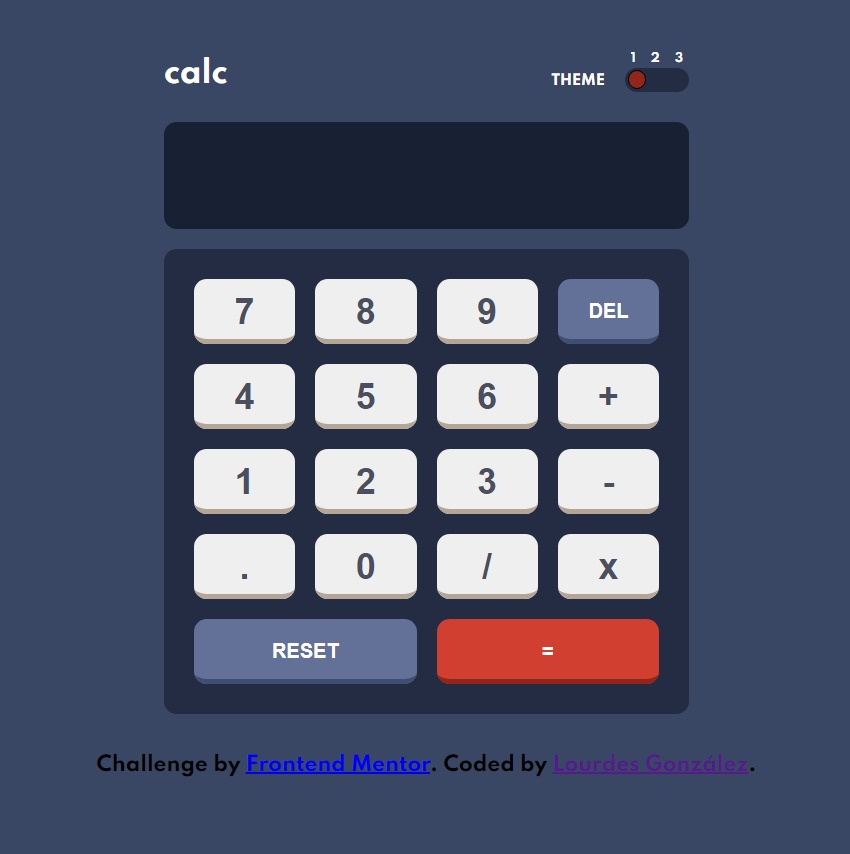

# Frontend Mentor - Calculator app

## Welcome! 👋

This is a solution to Calculator app on Frontend Mentor.

[Frontend Mentor](https://www.frontendmentor.io) challenges help you improve your coding skills by building realistic projects.

## The challenge

The challenge is to build out this calculator app and get it looking as close to the design as possible.

The users can be able to:

- See the size of the elements adjust based on their device's screen size
- Perform mathematical operations like addition, subtraction, multiplication, and division
- Adjust the color theme based on their preference

### Links

- Solution CODE: [https://github.com/lougc/calculator-app]
- Live Site URL: [https://lougc.github.io/calculator-app/]

## My process

### Built with

- Semantic HTML5 markup
- CSS custom properties
- Flexbox
- CSS Grid
- JavaScript

## Author

- Website - [https://lougc.github.io/portfolio]
- Frontend Mentor - [https://www.frontendmentor.io/profile/lougc]
- Linkedin - [https://www.linkedin.com/in/lougc/]
